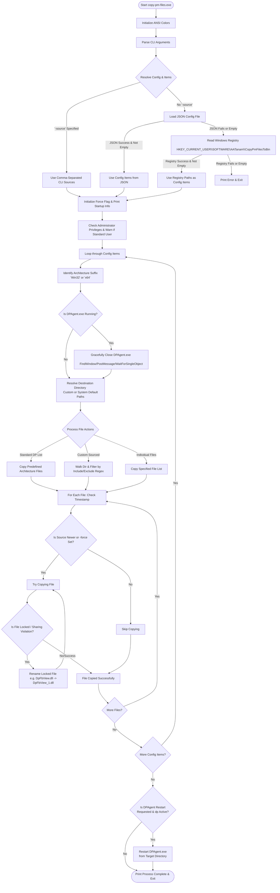

# DigitalPersona PM File Copier (Go Version)

A robust, lightweight command-line utility written in Go for copying DigitalPersona PM native binaries and driver files from build output directories to the system's DigitalPersona installation directory.

This utility is a direct conversion of the original C# WinForms application `CopyPmFilesToBin` to Go. It keeps all of the original functionality intact, adding a cleaner command-line interface, detailed progress logs, and helpful system privilege warnings.

---

## Table of Contents

- [Key Features](#key-features)
- [Configuration File Format & Structure](#configuration-file-format--structure)
  - [Flexible Path Syntax (Slashes & Normalization)](#flexible-path-syntax-slashes--normalization)
  - [Comments Support](#comments-support)
  - [Structure Breakdown](#structure-breakdown)
  - [JSON Schema Template (with comments & mixed slashes example)](#json-schema-template-with-comments--mixed-slashes-example)
- [Detailed Configuration & Target Mode Clarification](#detailed-configuration--target-mode-clarification)
  - [Important: Target Modes vs. Utility Compilation](#important-target-modes-vs-utility-compilation)
  - [Windows Registry Configuration & Fallback Format](#windows-registry-configuration--fallback-format)
- [How to Run](#how-to-run)
  - [Command-Line Arguments](#command-line-arguments)
  - [Examples](#examples)
  - [Example Configurations](#example-configurations-tests-directory)
- [Folder Structure](#folder-structure)
- [How It Works](#how-it-works)
- [How to Build and Run (Using NPM/Node scripts)](#how-to-build-and-run-using-npm-node-scripts)
  - [Using NPM Scripts](#using-npm-scripts)
- [How to Build (Using Native Go Commands)](#how-to-build-using-native-go-commands)

---

## Key Features

1. **Flexible Configuration Resolution (Hierarchical Fallback)**:
   - **CLI Source flag (`-source`)**: Manually pass a comma-separated list of paths to bypass configuration files completely.
   - **Custom Config File (`-config <path>`)**: Point the tool to a custom JSON configuration file.
   - **Default Config File (`config.json`)**: Looks for a `config.json` file in the current working directory, and falls back to looking next to the executable.
   - **Windows Registry Compatibility**: If no config files are found or configured paths are empty, it automatically reads the registry key used by the C# application (`HKEY_CURRENT_USER\SOFTWARE\AATanam\CopyPmFilesToBin`), making it fully backward-compatible with your existing registry setup!

2. **Graceful DPAgent Termination**:
   - Uses native Windows Win32 API (`FindWindowW`, `PostMessageW`, and `WaitForSingleObject`) via `golang.org/x/sys/windows` to gracefully request `DPAgent.exe` to close, and waits for its exit before performing the file copy.

3. **Intelligent Timestamp Checking**:
   - Compares Last Modified UTC times between the source and destination files. Files are only copied if the source file is strictly newer, saving writes and avoiding unnecessary copying.

4. **Locked File Handling (File-In-Use Renaming)**:
   - If copying fails because a file is locked or in use (Sharing Violation error `0x80070020`), the tool automatically renames the existing locked destination file (e.g., `DpFbView.dll` -> `DpFbView_1.dll`, `DpFbView_2.dll`, etc.) and retries the copy successfully.

5. **Administrator Privilege Warning**:
   - Since copying to `C:/Program Files` or `C:/Program Files (x86)` requires elevated privileges on Windows, the tool checks for administrator rights on startup and outputs a user-friendly warning if it's run as a standard user.

---

## Configuration File Format & Structure

If you prefer using a `config.json` file rather than command-line arguments or the Windows Registry, you can place a `config.json` next to your executable.

### Flexible Path Syntax (Slashes & Normalization)
- **Mixed Slashes**: Both forward slashes (`/`) and backslashes (`\`) are fully supported.
- **Forward Slashes**: Use `/` in configuration paths (recommended; no escaping required in JSON).
- **Backslashes**: Windows-style `\` paths are also accepted at runtime and normalized automatically.
- **Normalization**: Paths are automatically cleaned to match the host operating system's standard.
- **Trailing Slashes**: Trailing slashes are automatically stripped (e.g., `C:/Folder/` becomes `C:/Folder`), preventing errors in suffix matching or folder joins.

### Comments Support
This utility supports **JSON comments**. You are free to document your configurations directly inside JSON files using:
- **Single-line comments** starting with `//`
- **Multi-line block comments** starting with `/* ... */`

They will be stripped out before parsing, allowing for rich configuration notes.

### Structure Breakdown

The configuration file is written in standard JSON format (with comment support). It begins with a top-level key named `"items"`, which is an array of configuration blocks/action sets.

Each item in `"items"` contains:
- **`name` (String, Optional)**: The unique identifier for this configuration set. If specified, it can be selected via the `-set <name>` flag on startup.
- **`isActive` (Boolean)**: If set to `true`, this set will be processed during a default run (when no specific set is designated using the `-set` flag).
- **`paths` (Object, Optional)**: Contains details on directory paths and inclusion/exclusion matching:
  - **`dp` (Boolean)**: If `true`, the application executes its standard predefined file copies (such as `win32Files` or `x64Files`). If `false` or omitted, custom folder-to-folder file copying is performed based on directories.
  - **`src` (Object)**:
    - **`debug` (Array of Strings)**: Source directories where the Debug compiled files reside.
    - **`release` (Array of Strings)**: Source directories where the Release compiled files reside.
    - *Note: Source directories must end with either `Win32` or `x64` to designate their architecture.*
  - **`dst` (Object)**:
    - **`win32` (String)**: Target folder for Win32 files (defaults to `%ProgramFiles(x86)%\DigitalPersona\Bin`).
    - **`x64` (String)**: Target folder for x64 files (defaults to `%ProgramFiles%\DigitalPersona\Bin`).
  - **`srcFilesInclude` (Array of Strings, Optional)**: Active only when `dp` is `false`. List of regular expression patterns. Only files whose relative paths from the source directory match any of these patterns are copied. If omitted, all files are matched by default.
  - **`srcFilesExclude` (Array of Strings, Optional)**: Active only when `dp` is `false`. List of regular expression patterns. Any files matching these patterns are excluded from being copied.
  - **`restart` (Boolean, Optional)**: Active only when `dp` is `true`. If set to `true`, the utility will automatically restart `DPAgent.exe` from the target binary folder once all copying actions are complete.
- **`files` (Array of Objects, Optional)**: An alternative block of actions specifying individual files to copy directly:
  - **`src` (String)**: Full path and filename of the source file.
  - **`dst` (String)**: Full path and filename of the destination file.

### JSON Schema Template (with comments & mixed slashes example)

```json
{
  "items": [
    {
      "name": "dp-binaries",
      "isActive": true,
      "paths": {
        "dp": true,
        "restart": true,
        "src": {
          "debug": [
            "C:/y/c/dp/pm-native/src/~Output/Debug.Win32/",
            "C:/y/c/dp/pm-native/src/~Output/Debug.x64"
          ],
          "release": [
            "C:/y/c/dp/pm-native/src/~Output/Release.Win32",
            "C:/y/c/dp/pm-native/src/~Output/Release.x64/"
          ]
        },
        "dst": {
          "win32": "",
          "x64": ""
        }
      }
    },
    {
      "name": "custom-wildcard-copier",
      "isActive": false,
      "paths": {
        "dp": false,
        "src": {
          "debug": [
            "C:/build/Debug.Win32"
          ],
          "release": [
            "C:/build/Release.Win32"
          ]
        },
        "dst": {
          "win32": "C:/Target/Win32"
        },
        "srcFilesInclude": [
          "\\.dll$",
          "\\.exe$"
        ],
        "srcFilesExclude": [
          "test.*"
        ]
      }
    },
    {
      "name": "individual-files",
      "isActive": true,
      "files": [
        {
          "src": "C:/my_source/custom_driver.sys",
          "dst": "C:/Windows/System32/drivers/custom_driver.sys"
        }
      ]
    }
  ]
}
```

*Note: Using forward slashes `/` in paths is highly recommended so that no escaping is required in JSON strings.*

---

## Detailed Configuration & Target Mode Clarification

### Important: Target Modes vs. Utility Compilation
It is crucial to clarify that the **Debug** and **Release** target modes **do not describe how this utility itself is compiled**, nor does running with `-release` change the performance characteristics of this Go tool. Rather:
* **The mode dictates which sets of your project's compiled binary files are being targeted for copying.**
* When running in **Debug mode** (default), the utility reads the paths where your C++/C# compiler outputs the **Debug target builds** (typically ending with `Debug.Win32` and `Debug.x64`).
* When running in **Release mode** (using `-release`), the utility targets the paths where your compiler outputs the **Release target builds** (typically ending with `Release.Win32` and `Release.x64`).

### Windows Registry Configuration & Fallback Format

If no command-line source directories are specified via `-source`, and no local `config.json` is found (or its paths list is empty), the utility automatically falls back to reading configuration from the Windows Registry.

The utility reads from the following registry path:
* **Registry Key**: `HKEY_CURRENT_USER\SOFTWARE\AATanam\CopyPmFilesToBin`

Within this key, the utility looks for two specific values depending on the target mode:

1. **`sourcePathsDebug`** (Multi-String / `REG_MULTI_SZ`):
   - Used when running in **Debug mode** (the default mode, without `-release`).
   - Contains a list of source folders containing the Debug compiled native binaries and driver files.
   - Example folders: `C:\MyProject\src\~Output\Debug.Win32`, `C:\MyProject\src\~Output\Debug.x64`.

2. **`sourcePathsRelease`** (Multi-String / `REG_MULTI_SZ`):
   - Used when running in **Release mode** (using `-release`).
   - Contains a list of source folders containing the Release compiled native binaries and driver files.
   - Example folders: `C:\MyProject\src\~Output\Release.Win32`, `C:\MyProject\src\~Output\Release.x64`.

#### Accepted Registry Data & Behavior

* **Value Type**: Must be a **Multi-String Value** (`REG_MULTI_SZ`). In Windows Registry Editor (`regedit.exe`), you can create this by right-clicking on the `CopyPmFilesToBin` key, selecting **New** -> **Multi-String Value**, and naming it either `sourcePathsDebug` or `sourcePathsRelease`.
* **Value Data**: Each line in the Multi-String value represents one source directory path.
* **Architecture Suffix Detection**: Each directory path defined in these multi-string values must end with either `Win32` or `x64` (case-insensitive, e.g., `C:\Output\Debug.Win32` or `C:\Output\Debug.x64`).
  - **Win32 source directories**: Target files are copied to the standard 32-bit (x86) DigitalPersona installation folder: `%ProgramFiles(x86)%\DigitalPersona\Bin` (typically `C:\Program Files (x86)\DigitalPersona\Bin`).
  - **x64 source directories**: Target files are copied to the standard 64-bit DigitalPersona installation folder: `%ProgramFiles%\DigitalPersona\Bin` (typically `C:\Program Files\DigitalPersona\Bin`).
* **Path Slashes & Normalization**: The registry paths support both forward slashes (`/`) and backslashes (`\`). They are automatically cleaned and normalized at runtime:
  - Trailing slashes are stripped.
  - Windows-style backslashes are resolved properly.
  - Spaces in paths are fully supported without needing quotes inside the registry value editor.
* **Predefined File Lists**: Since the registry fallback processes standard DigitalPersona copying (equivalent to setting `"dp": true` in a JSON config), it copies the predefined set of files matching the architecture of the source folder:
  - **Win32 Predefined Files**: `DpAgent.exe`, `DpFbView.dll`, `DpOFeedb.dll`, `DpoPS.dll`, `DpoSet.dll`, `DPPMAdminConsole.exe`, `DpoSetA.dll`, `DpoTrain.dll`, `DpoTrainMgr.dll`, `DpStgCat.dll`
  - **x64 Predefined Files**: `DpAgentOtsPlugin.dll`, `DpAgentOtsPlugin.WebSdk.dll`, `DpFbView.dll`, `DpImporter.dll`, `DpMiniDS.dll`, `DpOCache.dll`, `DpOFeedb.dll`, `DpOnlineIDs.dll`, `DpoPS.dll`, `DpoSet.dll`, `DpOtsMsg.dll`, `DpUtt.dll`, `DsDashboard.dll`

---

## How to Run

### Command-Line Arguments

| Flag / Option | Description | Default Value & Usage Notes |
| :--- | :--- | :--- |
| `-release` | Targets **Release** compiled files instead of Debug compiled files. | `false` (by default, targets Debug compiled files). |
| `-config <path>` | Specifies the path to the custom JSON configuration file. | `"config.json"` (searches in the current working directory, falling back next to the executable). |
| `-source <paths>` | Comma-separated list of custom source directories to copy files from. Bypasses configuration files and Windows Registry fallbacks completely. | Unspecified.<br>- **Spaces**: Enclose the list in double quotes, e.g. `-source "C:/Folder With Spaces/Win32,C:/Other Folder/x64"`. <br>- **Commas**: Escape literal commas with a backslash, e.g. `\,`. |
| `-set <name>` | Designates a specific configuration set inside `config.json` to execute (and only this one). | Unspecified (by default, processes all sets where `isActive` is `true`). Executes the matching set regardless of its `isActive` flag status. |
| `-force` | Force copy all matched files, bypassing the default timestamp comparison checks. | `false` (by default, copies only if the source file is strictly newer than the destination). |
| `-restart` | Automatically restart `DPAgent.exe` immediately after all files have finished copying. | `false` (by default, DPAgent is stopped before copying but is not automatically restarted). Active only when the `dp` option is used. |

### Examples

```bash
# 1. Standard Run (Debug, uses registry fallback or local `config.json`):
# Run with administrator privileges
.\copy-pm-files.exe

# 2. Run in Release Mode:
.\copy-pm-files.exe -release

# 3. Run with Custom Paths directly (bypassing configs):
.\copy-pm-files.exe -source "C:/MySources/Debug.Win32,C:/MySources/Debug.x64"

# 4. Run with a Custom Configuration File:
.\copy-pm-files.exe -config C:/Users/Public/my_custom_config.json
```

---

### Example Configurations

We have provided several configurations inside the `tests/` folder for reference or testing:

- **`config_full_dual_arch.json`**: Complete setup with both Win32 and x64 directories configured for both Debug and Release environments.
- **`config_x64_only.json`**: Restricts actions only to the 64-bit destination.
- **`config_win32_only.json`**: Restricts actions only to the 32-bit (x86) destination.
- **`config_custom_drive_paths.json`**: Demonstrates the use of alternate drives and directory naming layouts (e.g. `D:/BuildServer`).
- **`config_empty.json`**: Empty arrays structure, triggering registry fallbacks when run.

You can try using any of these by passing the `-config` flag:
```bash
# Run using the custom drive configuration example
npm start -- -config tests/config_custom_drive_paths.json
```

---

## Folder Structure

- `src/`: Directory containing all Go source files.
  - `main.go`: Entry point and program orchestration.
  - `config.go`: Argument parsing, JSON configuration, and Windows Registry integration.
  - `help.go`: Modular help output displaying usage, default options, and behaviors.
  - `print.go`: Modular startup printing logic, active items formatting, and elevation warnings.
  - `process.go`: Graceful Win32 process search and close logic for `DPAgent.exe`.
  - `copy.go`: Core copy loop, timestamp comparison, and locked file renaming.
  - `version.go`: Auto-generated version declaration.
  - `copy_test.go`: Unit tests for file utility behaviors.
  - `config_test.go`: Unit tests for argument resolution, configuration loading, and comment-stripping logic.
- `scripts/`: Development and utility scripts.
  - `build.js`: Auto-incrementing version builder that compiles the Go binary.
- `tests/`: Directory containing various preconfigured examples of JSON configuration files.
- `config.json`: Sample configuration file template.
- `package.json`: NPM package manifest for unified scripts (run, test, build).
- `.gitignore`: Configured to ignore Go/Node/Windows artifacts and generated binaries.

---

## How It Works

This utility orchestrates a structured, multi-step pipeline to safely and efficiently copy binary files into protected system directories on Windows. Below is an overview of the key phases and a visual execution flow diagram.

### Key Phases of Execution

1. **Initialization & CLI Parsing**: 
   - Activates ANSI virtual terminal sequence processing to support colored console logs in Windows.
   - Parses the command-line flags (`-release`, `-config`, `-source`, `-set`, `-force`, and `-restart`).
   - Checks if running with Administrator privileges and outputs a standard user warning if copying might require elevation.

2. **Hierarchical Configuration Resolution**:
   - **Step A**: Checks if `-source` was specified. If yes, it bypasses files and registry entirely.
   - **Step B**: Otherwise, it tries to read the specified configuration JSON (defaulting to `config.json` next to the working directory or the executable). Comment lines (`//` and `/* ... */`) are dynamically stripped before parsing.
   - **Step C**: If JSON loading fails or the paths list is empty, it queries the Windows Registry key `HKEY_CURRENT_USER\SOFTWARE\AATanam\CopyPmFilesToBin` (reading either `sourcePathsDebug` or `sourcePathsRelease` multi-string values).
   - **Step D**: If all resolution paths yield no folders, the process exits with a helpful error.

3. **Target Mode & Path Normalization**:
   - Normalizes all forward/backward slashes and strips trailing slashes to prevent join errors.
   - Categorizes each source path as `Win32` or `x64` based on suffix detection (e.g., `Debug.Win32`).

4. **Graceful Service Termination & Restart**:
   - Before attempting to overwrite any binaries, the utility uses the Win32 API (`FindWindowW` and `PostMessageW`) to safely post a `WM_CLOSE` message to the `DPAgent.exe` application window.
   - It waits up to 10 seconds for the service process to exit peacefully, preventing file lock conflicts.
   - If the `-restart` CLI flag or optional `restart: true` JSON configuration property is active when using the `dp` option, `DPAgent.exe` will be automatically launched/restarted immediately after all copy operations have finished.

5. **Smart Timestamp Comparison & Force Flag**:
   - For each target file, the tool compares the source and destination files' "Last Modified" times in UTC.
   - Files are skipped if the source is not strictly newer, avoiding redundant write operations. This check can be bypassed entirely using the `-force` command-line flag.

6. **Locked File Renaming (Conflict Resolution)**:
   - If a target DLL or binary is actively locked by another process (e.g., a background service, explorer, or browser extension), a Sharing Violation error (`0x80070020`) occurs.
   - The tool handles this by automatically renaming the locked target file in the destination folder to a backup name (e.g., `DpFbView.dll` is renamed to `DpFbView_1.dll`, then `DpFbView_2.dll`, etc.) and retrying the copy.

7. **Copy Execution Modes**:
   - **Predefined Files List**: Used when `"dp": true` (default/registry). Copies a strict predefined list of native files belonging to DigitalPersona.
   - **Custom Sourced (Wildcard Matching)**: Used when `"dp": false`. Performs a directory walk over the source folder, applying custom regular expressions (`srcFilesInclude` / `srcFilesExclude`) to filter which files to copy.
   - **Individual Files list**: Copies designated source-to-destination file pairs explicitly.

### Execution Flow Diagram



---

## How to Build and Run (Using NPM/Node scripts)

You can run the project using standard `npm` commands or the direct `go` commands below.

### Using NPM Scripts

- **Run in Debug Mode (Default):**
  ```bash
  npm start
  ```
- **Run in Release Mode:**
  ```bash
  npm run start:release
  ```
- **Build the executable:**
  ```bash
  npm run build
  ```
  This creates the compiled binary in `bin/copy-pm-files.exe`.
- **Run unit tests:**
  ```bash
  npm test
  ```

---

## How to Build (Using Native Go Commands)

First, make sure you have Go installed on your machine.

1. Install dependencies (specifically the Windows system bindings package):
   ```bash
   go get golang.org/x/sys/windows
   ```

2. Compile the binary:
   ```bash
   go build -o copy-pm-files.exe
   ```
